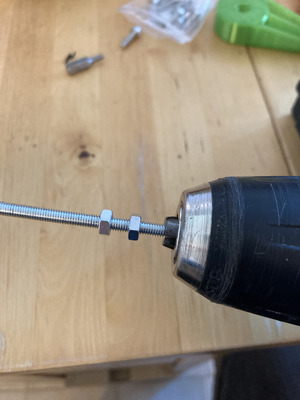
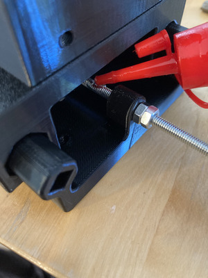
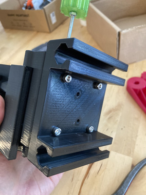

# Assembly instructions

## Initial setup

| Instruction | Picture |
| -----------------|----------------|
| - Gather pieces |  |
| - Tap the three carrier blocks with an M4 tap |  | 
| - Tap the Z interferometer carrier mounting holes with an M4 tap |  | 
| - Cleanup the M4 rod guiding holes |  | 
| - Cleanup the Carrier blocks mounting holes |  | 

## Z AXIS

| Instruction | Picture |
| -----------------|----------------|
| - Mount the Z carrier block with two M4 flat head screws and nuts : pay attention to the orientation ! |     |
| - Mount the interferometer carrier |    |
| - Prepare a M4 rod with two M4 nuts tightened against each other at the end and secured with cyanoacrylate glue |     |
| - This becomes a kind of handle : use it to run the rod through the whole Z stage, starting at the bottom |    |
| - Butt the two nuts against the lower Z rod guide |  |
| - On the other side, run three nuts, two of which must butt against the upper Z rod guide, be tightened against each other, and secured with CA glue. They must butt against the guide as any space left here will become backlash in the Z axis. |   |
| - Add the Z knob, add another M4 nut, and secure this assembly very well by tightening it and adding CA glue |    |
| - Add oil on the rod, on both sides of the Z carrier block, and where the nuts butt against the guides. |  |
| - Add the Z handle  |  |

**Congratulations ! You have completed the Z axis !**

## Y AXIS

| Instruction | Picture |
| -----------------|----------------|
| - Take the Y axis upper part and run 2 M4 screws through the Z axis mounting holes |   | 
| - Screw the Z axis to the Y axis |   | 
| - Add CA glue where the two Z axis pillars meet the Y axis top |  | 
| - Take the Y axis carrier block and run two M4 screws through it |  | 
| - Place it on the lower Y axis, and run this in the Y gliders |     | 
| - Flip the assembly and secure the screws through the hole |    | 
| - You now have a free-gliding Y axis. Repeat the steps of the Z rod assembly to add motion. |   | 

**Congratulations ! You have completed the Y axis !**

## X AXIS

| Instruction | Picture |
| -----------------|----------------|
| - Repeat those same steps for the X axis. |    | 

**Congratulations ! You have a full XYZ table !**

## BEFORE USE

- Lubricate every mating surface on every axis
- Lubricate every spot where nuts butt against rod guides
- Lubricate rods on each side of the carrier blocks
- Run each axis two times from an end to another