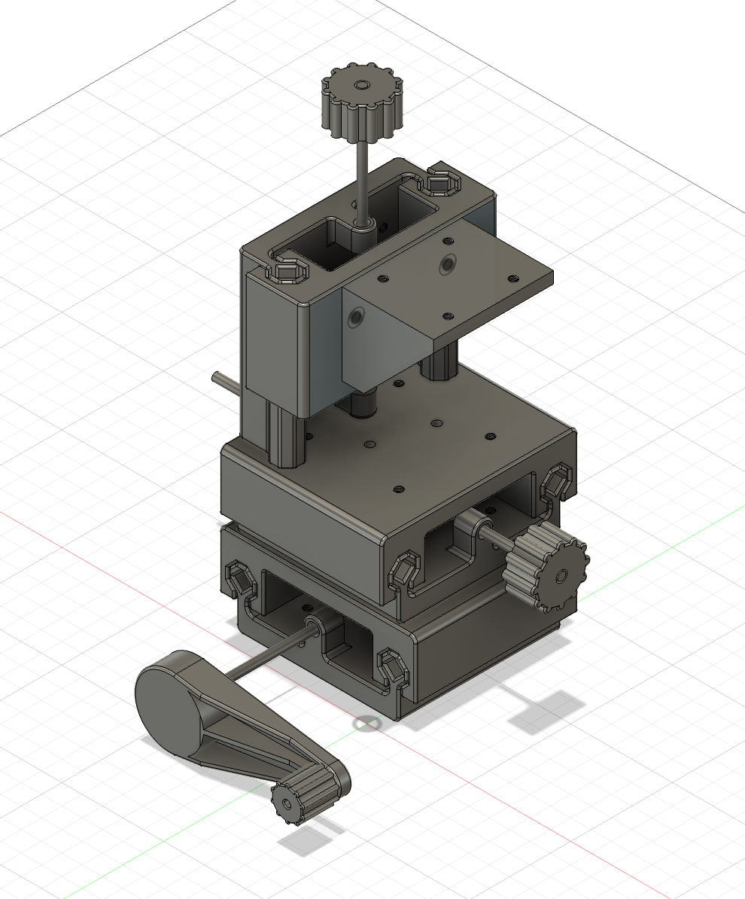

# Wip : low-BOM printable XYZ platform for Bath Interferometers

- 

Only uses M4 rods and M4 screws as vitamins.  
The rail clearance is set to 0.075mm or 2.9 thousandths of an inch. Know your printer and print carefully.  
This was tested to print fine.  

## A few tips :

- Dry your filament.
- Do not print too fast.
- Use PETG
- Re-tap the screw holes before assembly
- Tap the carrier blocks **with oil** before assembly
