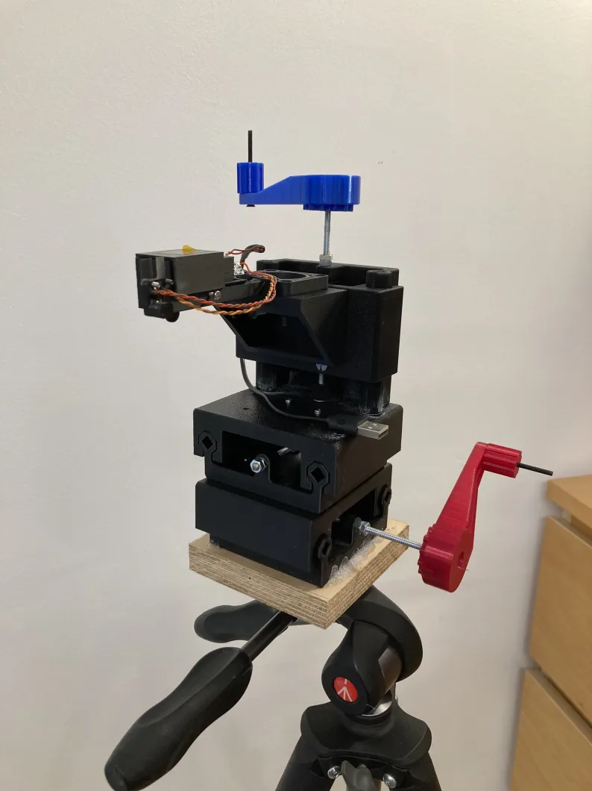

# Low-BOM printable XYZ platform for Bath Interferometers

 Licensed under Creative Commons BY-NC-SA 4.0 

| | |
|-|-|
| | |
| coarse controls | fine control handles |

## Please know your printer and use the TOLERANCE TEST

You have to print **everything** flawlessly for smooth motion. To determine what STLs to use, please print the TOLERANCE TEST. It should slide freely, with a bit of sanding if you mis-placed the seam while slicing.
**Pay attention to the seam position !** Seam traps are on the roadmap but not implemented yet.

### Why is the tolerance test so big ?

Good question : I found that my smaller tolerance tests (one rail only) did not give correct information as whether a whole stage would be smooth.

The tolerance is the fine space in this screenshot. The smallest you can print, the best :

| Name | Value | Printed and tested |
|---|---|---|
| Tightest | 0.07mm |  ✅ (Bambu P1S) |
| Tight | 0.1mm |  |
| Easy | 0.125mm |  |

## Prints BOM

- Print the TOLERANCE TEST and choose accordingly
- Print everything in the `Common` folder in the quantities listed in file names
- Print everything in the folder corresponding to your chosen tolerance

## Vitamins BOM

| Design. | Quantity |
|-------|-------|
| M4 rod | 3 |
| M4 nut | 12 |
| M4 screw x 14mm | 16 |
| Superglue | Some |

Only uses M4 rods and M4 screws as vitamins. Superglue is used to lock the nuts and suppress Z axis wobble at the joint with the Y axis.

## A few tips :

- Dry your filament.
- Do not print too fast.
- Use PETG
- Re-tap the screw holes before assembly
- Tap the carrier blocks **with oil** before assembly

Thanks Paul for design advice !

